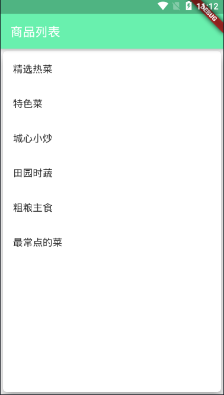
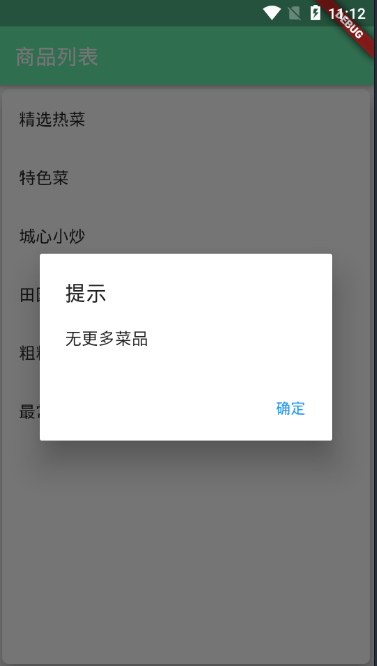
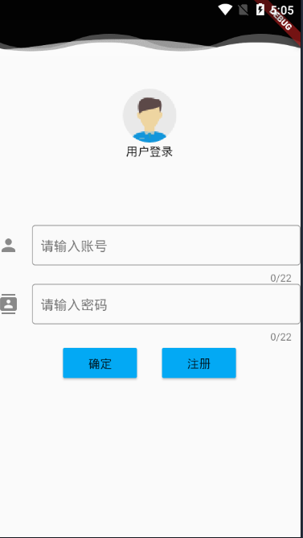
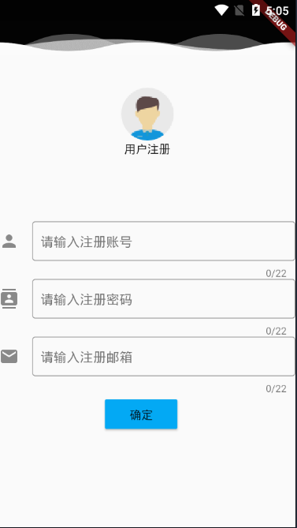
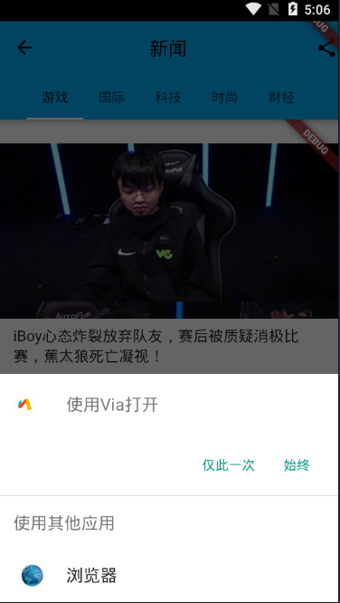
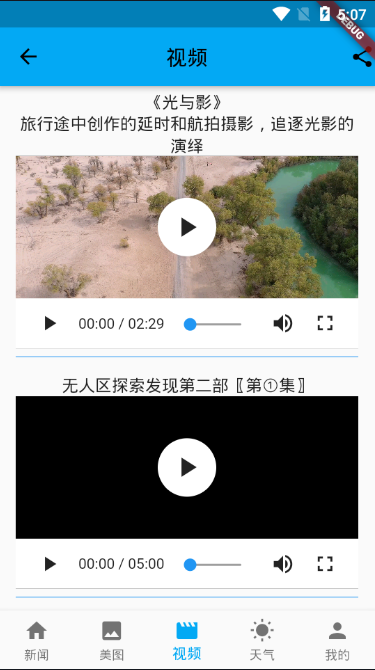
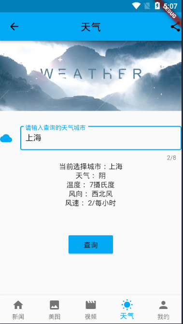
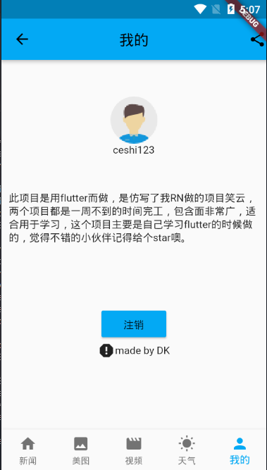
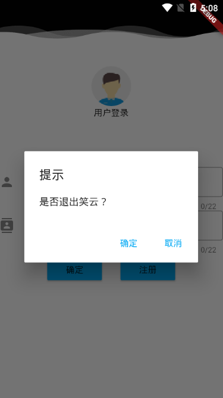

# Day1 Flutter Learning
之前学习RN已经做出了一款包含还比较全面的app，最近谷歌的flutter势头非常好，于是来学习一下flutter，依然是看视频+文档来学习，flutter使用的是dart语法，对于没学习dart语法的人想马上上手还是挺困难的，目前根据学习做了许多组件，布局，导航和HTTP的练习实例，都在根目录lib/main.dart里面，如果也有想学习的小伙伴，可以看看这些实例，目前的感觉是flutter用起来确实比RN方便。  
组件：  
1.Container  
2.Image  
3.ListView  
4.GridView  
布局：  
1.Row  
2.Column  
3.Stack  
4.Positioned  
5.Card  
导航：  
1.Navigator(父向子传参)  
2.Navigator(子向父传参)  
HTTP：  
1.get,post请求  

  
# Day2 仿写之前的RN项目笑云app
按照之前react native的思路用flutter仿写了一遍app，基本上还原原来的东西，由于flutter社区目前还在高速发展中，有些东西还没有RN那么完善，该项目拥有广告页，登录页面，注册页面，底部导航栏页面，新闻页面，美图页面，推荐视频页面，天气页面，我的页面，全部采用了真实API进行数据的获取和运用，包含面非常广，事学习flutter的好帮手，小伙伴们如果觉得对你有帮助的话，不妨右上角点个start噢。  

  
